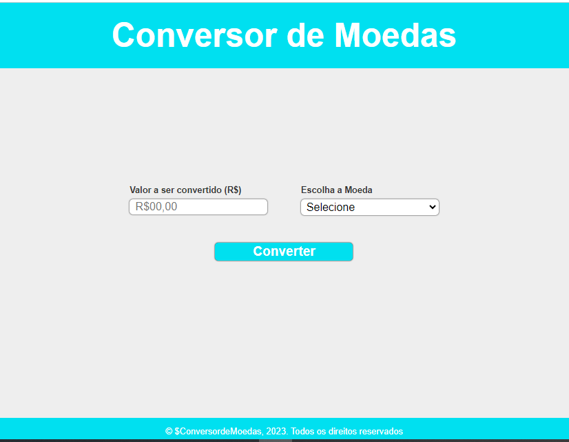

<h1 align="center"> Conversor de Moedas </h1>

Programa converte valor em Reais(R$), para Dolar(USD e Euro(EUR) buscando a cotacao atual de mercado)  

  <a href="#-tecnologias">Tecnologias</a>&nbsp;&nbsp;&nbsp;|&nbsp;&nbsp;&nbsp;
  <a href="#-projeto">Projeto</a>&nbsp;&nbsp;&nbsp;|&nbsp;&nbsp;&nbsp;

 

  

## 🚀 Tecnologias

Esse projeto foi desenvolvido com as seguintes tecnologias:

- HTML e CSS
- JavaScript
- Git e Github
- Chamada de API

## 💻 Projeto

Conversor em tempo real de Real/Dolar e Real/Euro

- [Acesse o projeto finalizado, online](https://cintiaomaas.github.io/portifolio/)

